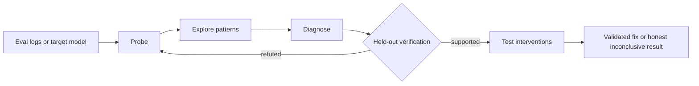

<div align="center">

# EvalVitals

### Your eval tells you *what* failed. EvalVitals investigates *why*—and tests what fixes it.

[](https://pypi.org/project/evalvitals/)
[](https://pypi.org/project/evalvitals/)
[](https://github.com/evalvitals/evalvitals/actions/workflows/ci.yml)
[](https://evalvitals.github.io/evalvitals/)
[](LICENSE)

[Get started](#quickstart-analyze-your-eval-logs) · [Documentation](https://evalvitals.github.io/evalvitals/) · [Examples](examples/README.md) · [PyPI](https://pypi.org/project/evalvitals/)

</div>

Most evaluation tools end with a score and a table of failures. EvalVitals
starts there. It can explore raw eval logs, find recurring patterns, propose
falsifiable explanations, test them on held-out cases, and validate candidate
interventions against the unchanged baseline.

Use the whole investigation loop—or take only the layer you need:

- **Explore existing results:** point a coding agent at arbitrary JSON/JSONL
  logs and get observations, charts, tables, and testable hypotheses.
- **Investigate a target model:** adaptively probe failures, diagnose systematic
  modes, verify hypotheses, and test interventions.
- **Run one focused analyzer:** use the same sklearn-like interface for
  black-box APIs and white-box local models.



## Quickstart: Analyze Your Eval Logs

Install EvalVitals with the report dashboard:

```bash
pip install "evalvitals[dashboard]"
```

Then point it at a file or directory of JSON/JSONL results:

```bash
evalvitals explore ./results \
  --backend codex \
  -q "What distinguishes failed cases from successful ones?" \
  --dashboard
```

`codex` can be replaced with `claude_code`, `opencode`, `gemini_cli`,
`kimi_cli`, or `antigravity`. The selected coding-agent CLI must be installed
and authenticated separately.

Prefer a browser? `evalvitals web` serves a local data-analysis workbench:
drop a **.zip** containing JSON/JSONL/CSV/TSV/Parquet/Excel data and/or images,
PDFs, audio, or video. Each upload becomes a persistent data thread: the page
shows ingestion and M2/M3 progress, renders M2 as soon as it finishes, and
accepts artifact-grounded follow-up questions without uploading again.

EvalVitals writes an auditable analysis bundle instead of returning only prose:

```text
evalvitals_explore_output/
├── exploratory_report.json   # observations, candidate signals, hypotheses
├── records.json              # normalized records used by the analysis
├── figures/                  # rendered charts
├── tables/                   # analysis-ready tables
└── analysis.py               # the generated code that was actually run
```

**A real bundled run:** on the synthetic-yield example, Explore identified
temperature as the strongest observed correlate (`r = 0.86`), separated that
finding from weak pressure evidence (`r = -0.21`), and proposed mechanism-level
hypotheses for a later confirmatory experiment. [See the reproducible example →](examples/m2_statistics/synthetic_yield_explore/)

Already have your own analysis code? Use the analyzer toolkit directly, or
feed the resulting cases into the full diagnosis loop. EvalVitals does not
require you to replace your existing eval or observability stack.

## What Makes It Different

| Typical eval workflow | EvalVitals |
|---|---|
| Aggregate a metric | Investigate the cases behind the metric |
| Browse failures manually | Search for recurring, structured failure modes |
| Accept an LLM explanation | Turn explanations into falsifiable hypotheses |
| Test on the same cases used for discovery | Separate exploration from held-out confirmation |
| Report a promising prompt rewrite | Compare interventions with the unchanged baseline |
| Choose either API-level or internal analysis | Negotiate black-box and white-box capabilities through one interface |

Statistical gates use paired tests and e-values, including multiplicity control
when several hypotheses or fixes are tried. A run may end **inconclusive**;
EvalVitals does not turn weak evidence into a success verdict.

## Three Ways to Use EvalVitals

### 1. Explore — raw results to testable hypotheses

`evalvitals explore` recursively samples arbitrary JSON/JSONL shapes. The
coding agent performs exploratory data analysis; the host records generated
code, adjudicates host-checkable statistics, renders figures, and proposes
1–3 falsifiable hypotheses.

[Explore guide →](docs/m2_analysis.md)

### 2. Investigate — failures to verified interventions

`VLDiagnoseLoop` chains the full workflow:

```text
M1 targeted probes
 → M2 exploratory and statistical analysis
 → M3 diagnosis hypotheses
 → M5 held-out hypothesis verification
 → M4 surgery and tiered fixes
```

Interventions can range from prompt changes and scaffolds to read/write access
to model internals. Each candidate is evaluated against the unmodified
baseline; automatic escalation happens only when explicitly enabled.

[Full-loop quickstart →](docs/quickstart.md#vldiagnoseloop--automated-failure-attribution-current) ·
[Intervention guide →](docs/intervention.md)

### 3. Analyze — one model, one question

Every registered analyzer follows the same call shape:

```python
from evalvitals import Capability, compose
from evalvitals.analyzers.attention.summary import AttentionAnalyzer

model = compose(
    "qwen2.5-7b-instruct",
    "hf_local",
    want={Capability.ATTENTION},
)

result = AttentionAnalyzer(layer=-1, top_k=5).run(
    model, "The Eiffel Tower is in"
)

print(result.summary())
```

The analyzer zoo includes attention, uncertainty, hallucination, attribution,
logit-lens, representation-geometry, and agent-trajectory analysis.

[Browse the Analyzer Zoo →](docs/analyzers.md)

## Installation

The core install stays lightweight—no Torch required:

```bash
pip install evalvitals
```

Add only the capabilities you need:

```bash
pip install "evalvitals[api]"        # OpenAI-compatible API models
pip install "evalvitals[local]"      # local Hugging Face models + Torch
pip install "evalvitals[interp]"     # interpretability toolchains
pip install "evalvitals[viz]"        # plots
pip install "evalvitals[dashboard]"  # Streamlit reports
pip install "evalvitals[stats]"      # inferential statistics
```

For development:

```bash
git clone https://github.com/evalvitals/evalvitals.git
cd evalvitals
pip install -e ".[dev]"
pytest -m "not gpu"
```

## Architecture in One Minute

Model identity is separate from runtime, and analyzers declare the
capabilities they need. The same model spec can run through a black-box API or
a white-box local backend; only the available capability set changes.

| Contract | Role |
|---|---|
| `ModelSpec` | Model identity: family, repository, architecture traits, modalities. |
| `Backend` | Runtime: local internals, black-box API, or offline batch engine. |
| `Model` | Runnable model with generation and optional internal capture. |
| `Analyzer` | `Analyzer(**params).run(model, data) -> Result`. |
| `Capability` | Matches analyzers to compatible model runtimes before execution. |
| `FailureCase` | Prompts, labels, provenance, metadata, and agent trajectories. |
| `Result` | Human-readable summary plus structured, serializable findings. |

[Read the architecture guide →](docs/architecture.md)

## Reproducible Examples

| Example | What it demonstrates |
|---|---|
| [`synthetic_yield_explore`](examples/m2_statistics/synthetic_yield_explore/) | Standalone Explore on structured tabular outcomes. |
| [`deco_hallu_explore`](examples/m2_statistics/deco_hallu_explore/) | Explore → held-out hypothesis tests → tiered repair. |
| [`deco_hallu`](examples/diagnosis_loops/deco_hallu/) | Decoupled multimodal hallucination diagnosis and intervention. |
| [`qwen_attention`](examples/analyzer_demos/qwen_attention/) | White-box attention analysis on a local model. |

[See all examples →](examples/README.md)

## Documentation

- [Quickstart](docs/quickstart.md)
- [Exploratory Analysis](docs/m2_analysis.md)
- [Intervention & Verification](docs/intervention.md)
- [Analyzer Zoo](docs/analyzers.md)
- [Architecture](docs/architecture.md)
- [Extending EvalVitals](docs/extending.md)
- [Roadmap](docs/roadmap.md)

## Project Status

EvalVitals is an early-stage research toolkit. Interfaces may evolve, and some
full-loop examples require model weights, a GPU, or an external coding-agent
CLI. Bug reports, reproducible failure cases, analyzer contributions, and
evaluation integrations are welcome.

If EvalVitals helps you understand a model failure, consider starring the repo
and sharing the smallest reproducible case—it makes the toolkit better for the
next investigation.
